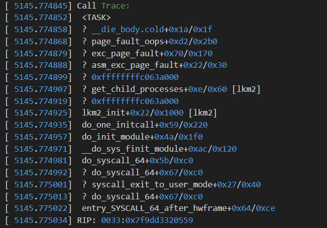

This readme describes the implementation details and considerations taken to create module lkm2
```
Write a kernel module that takes process ID as input, 
and for each of its child processes, print their pid and process state. 
Name the source file as lkm2.c
```
High-Level goal: Need to traverse the kernel process-tree.
Approach 1: DFS -> from &init_task.
1. Find out how to make command-line arguments available to the source-file -> via `module_param()`
2. Find out how process-tree is organised.
Refer: https://myaut.github.io/dtrace-stap-book/kernel/proc.html
2a. [Kernel API compared to STL code](https://stackoverflow.com/questions/16230524/explain-list-for-each-entry-and-list-for-each-entry-safe)
Q1. How are kernel threads and process different according to kernel?
3. Create module
3.1. How to obtain `task_struct` given a pid?
->`pid2task()`
Q1. Can a Kernel module by dynamically loaded by another module? (for usage as functions)
A: 

Approach 2: Refer pstree implementation.


Recovering from a Kernel crash 
Null pointer deference in kernel log via dmesg.
Call Trace: 
Indicates error in get_children.

Verified output by testing against pstree -p

Learnings:
1. Linux Linked-List Implementation: https://kernelnewbies.org/FAQ/LinkedLists via Linux Kernel API.
Adding to list is done via __list_add(new, prev, next)
2. Linux task_struct and process abstraction
